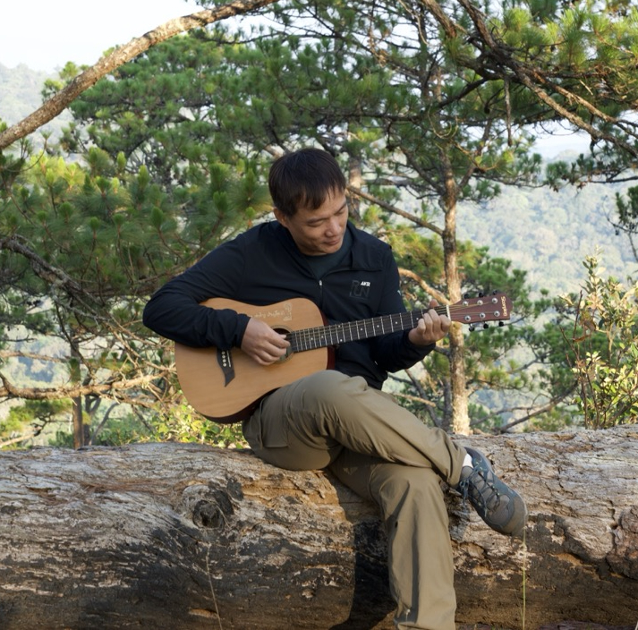

# Mạnh Vũ

- 👻 Hi, I’m Manh.

- 🤓 Person who loves music & travel.

- 👽 Coding: Elixir, Erlang, Dart, Golang, Delphi(deprecated) C/C++(deprecated).

- 🗺️ Location: 🇻🇳 Vietnam.

- 🌃 City: Ho Chi Minh city.

- 🏠 Hometown: Ha Long city.

## Social networking

[Dev.to](https://dev.to/manhvanvu/)

|  |  |
| ------------- | ------------- |
<!--  -->
<!--  -->
